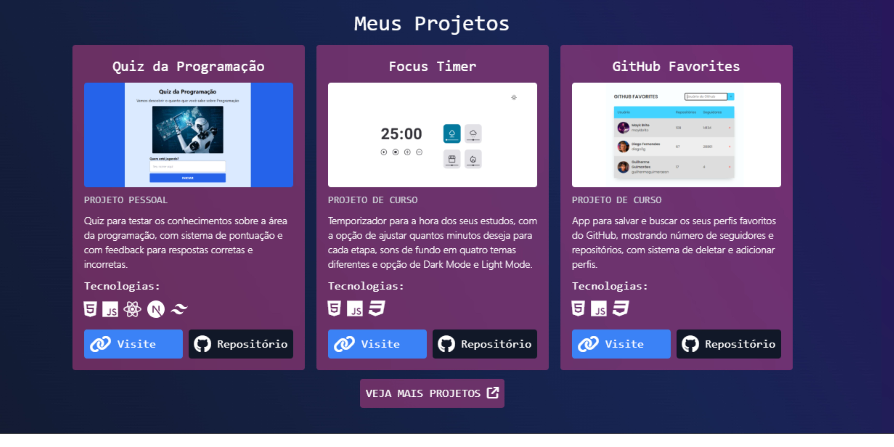

# Portifólio Guilherme Guimarães
 

## Descrição
Este projeto é o meu portfólio pessoal. O portfólio é projetado para apresentar minhas habilidades, experiências e projetos de maneira clara e atraente. A estrutura do site é organizada em várias seções, cada uma destacando diferentes aspectos sobre mim e sobre meus projetos.

## Funcionalidades Principais:
- **Interface Intuitiva:** Interface de usuário amigável e fácil de navegar, permitindo uma experiência de usuário agradável.

- **Animações Suaves:** Utiliza a biblioteca AOS (Animate on Scroll) para animações suaves, tornando a interação mais dinâmica.

- **Responsividade:** Informações adaptadas para diferentes tamanhos de tela, garantindo uma leitura agradável em qualquer dispositivo.

## Tecnologias utilizadas

- **Front-End:** `HTML5` `TailwindCSS` `CSS3`.

- **Javascript:** Para funcionalidades interativas e integração com bibliotecas.

- **Animações:** AOS (Animate on Scroll) para animações suaves ao rolar a página.

## Acessar o Projeto
Para testar o meu portifólio e conhecer um pouco sobre mim, clique aqui: [Portifólio Guilherme Guimarães](https://portifolio-guilherme-guimaraes-projects.vercel.app/)

## Autor
Desenvolvido com carinho por [Guilherme Guimarães](https://github.com/guilhermeguimaraesn).

Para entrar em contato: [LinkedIn](https://www.linkedin.com/in/guilhermegn/) ou através do email [guilhermeguimaraesnas@gmail.com]().
